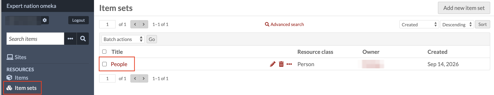
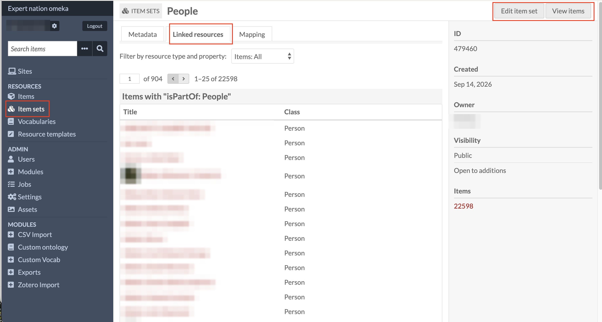
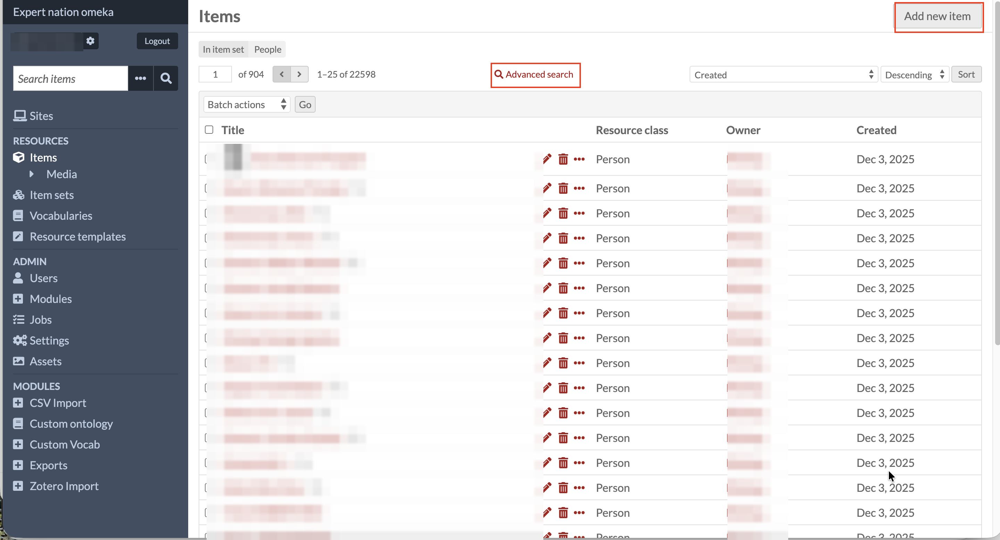

# Viewing Person Records

This collection has exactly one item set, called **People**, and every
Person record belongs to it (see
[Item Sets](the-omeka-s-universe/item-sets.md) for how item sets work more
generally). It's the fastest way to see person profiles specifically,
rather than the individual sub-records (Life events, Places, Military
service, and the rest) that also live in this database, but aren't
organised into an item set of their own.

<!--
Nicole: names, owner values, and person thumbnails in all three
screenshots below are pixelated before publishing, since this is a public
repo and these are live records. Only the layout and the highlighted
controls are meant to be legible.
-->

## 1. Accessing the People item set

In the admin sidebar, under **Resources**, click **Item sets**. Click
**People** to open it.

## 2. Viewing every person record: Linked resources

On the People item set's page, click the **Linked resources** tab. This
lists every item connected to the item set through the `isPartOf` field,
and since only Person records use that field to join People, what you get
is exactly every person profile in the collection, with nothing else mixed
in.

## 3. Working with the full list: View items

From the item set's page, **View items** (next to Edit item set, top
right) takes you to the same Person records through the regular Items
screen instead, filtered to "In item set: People." This view adds what
Linked resources doesn't have: the total record count, an
**Advanced search** link for building a proper query across just this
group, and an **Add new item** button for creating a new Person record
directly.

## Why use this instead of the general Items screen

The main Items screen mixes Person records in with every Life event,
Death, Place, and other supporting record in the database (see
[Items](the-omeka-s-universe/items.md)). Starting from the People item set
skips that: you land on person profiles only, without having to build an
Advanced Search first. See [Advanced Queries](03-advanced-queries.md) for
when you do need to search within that list, rather than just browse it.
