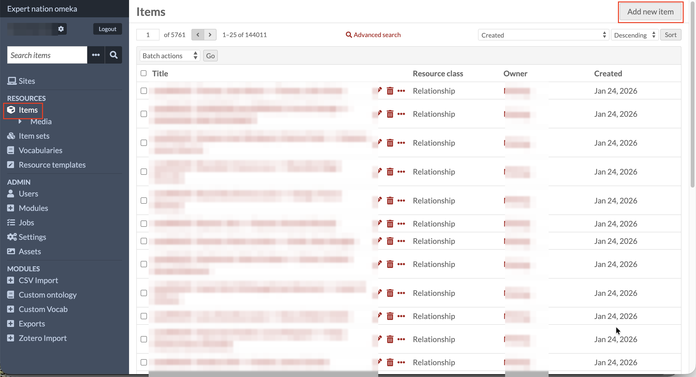
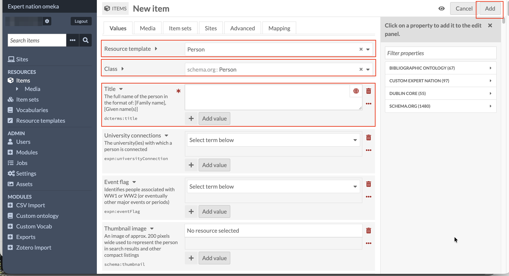

# Adding Person Records

<!--
Nicole: this page covers the two things every new record has in common
(creating an item, choosing the Person template) and then links out to a
separate, flat, top-level page per field, in the order it appears on the
form (no parent/has_children nesting anywhere in this guide). Add a new
bullet to "Continue with a specific field" below, and give the new page
the next available nav_order number, every time a new field page is
added.
-->

## Adding a new item

Every record in this collection, a Person, or any of the sixteen smaller
record types linked to one, is created the same way. In the left sidebar,
click **Items**, then **Add new item** (top right).

This works for every resource template in the system, not only the ones
covered here. The collection also holds resource templates for other
projects entirely (the "Relationship" records above are one example). This
guide only walks through building a **Person** record and the sub-templates
that get linked to one (Life event, Death, Military service, and the
rest), not every resource template that exists in the collection.

A quick note on an icon you'll see repeatedly from here on: several fields
on the Add Item screen show a small cube icon next to them: the same icon
used for the **Items** link in the sidebar and at the top of this page. It
marks a field that links to another Item, rather than to an Item Set (which
uses a different icon) or a plain value. This guide calls it **the Items
icon** wherever it comes up.

## Choosing the Person template

On the New item screen, set **Resource template** to **Person**. Doing
this automatically sets the **Class** field below it to `schema.org:Person`.
You don't need to touch Class yourself, but it's worth knowing what it is,
because you'll see it again on other record types.

**Resource template** and **Class** answer two different questions, which
is easy to blur together:

- The **resource template** controls what you see and do on this screen:
  which fields appear, what order they're in, their instructions, and
  which ones are required. It's Omeka's practical, editable form.
- The **Class** is a formal label for what *kind* of thing the record is,
  drawn from an established vocabulary (here, schema.org). It doesn't
  change what the form looks like. It's metadata about the record itself,
  used by search engines, data exports, and other systems that read this
  collection's data.

In practice, every resource template in this collection is tied to one
matching class, so choosing the template sets the class for you and you'll
rarely think about them separately. The distinction matters mainly so that
when "Class" turns up elsewhere in this guide, you know it's not just a
second name for the resource template.

**Title** is the first field on the form, and the only one with a red
asterisk. Its instructions give the exact format to use:
`[Family name], [Given name(s)]`, for example, `Smith, John Henry`. The
red asterisk marks a **required** field: Omeka won't let you save the
record until it has a value. Title is, in fact, the only required field
anywhere on the Person template; every other field can be left blank.

Title is also the clearest place to introduce **labels vs. properties**,
since you can see both on the same field: "Title" is the **label**, the
plain-language name shown on screen, the one you click into. Underneath
it, in small grey text, is `dcterms:title`, the **property**, the actual
field name Omeka uses internally, in Advanced Search's "Search by value"
dropdown, and in any data export. Every field on this form has both a
label and a property, and they often don't match (a label can be renamed
for participants without changing the property underneath). The full
label-to-property lookup for every field on the Person template is in the
[Quick reference guide](26-quick-reference-guide.md).

Once a record has its required Title (and anything else you want to add),
click **Add**, top right, to actually create it. Nothing is saved until
you do. This applies to every new item you create, not just Person
records.

## Continue with a specific field

Each field on the Person template that links to its own sub-record gets
its own page, covered in the order it appears on the form:

- [Early education: linking a Schooling record](09-adding-person-records-early-education.md)
- [Tertiary education: linking a Tertiary study record](10-adding-person-records-tertiary-education.md)
- [Place of birth: linking a Place record](11-adding-person-records-place-of-birth.md)
- [Life events: linking a Life event record](12-adding-person-records-life-events.md)
- [Related persons: linking a Relationship record](13-adding-person-records-related-persons.md)
- [Place of death: linking a Place record](14-adding-person-records-place-of-death.md)
- [Birth: linking a Life event record](15-adding-person-records-birth.md)
- [Military service: linking a Military service record](16-adding-person-records-military-service.md)
- [Military awards: linking a Military award record](17-adding-person-records-military-award.md)
- [Occupations: linking an Occupation eventlet record](18-adding-person-records-occupations.md)
- [Professional Association Memberships: linking a Professional association member record](19-adding-person-records-professional-associations.md)
- [Other events: linking an Eventlet record](20-adding-person-records-other-events.md)
- [Death: linking a Death record](21-adding-person-records-death.md)

The Person template also has a handful of media fields (Thumbnail
image, Additional photograph(s), Documents, and the rest) and URI
fields (Contact details or URL, Discovering Anzacs, and the other
external-link fields). Both work differently enough from the fields
above that they get their own sections later in this guide: see
[Adding media items](23-adding-media-items.md) and
[Adding links to other resources outside Omeka](24-adding-uri-links.md).

For the full label-to-property lookup covering every field on this
form, including the ones above, see the
[Quick reference guide](26-quick-reference-guide.md).
