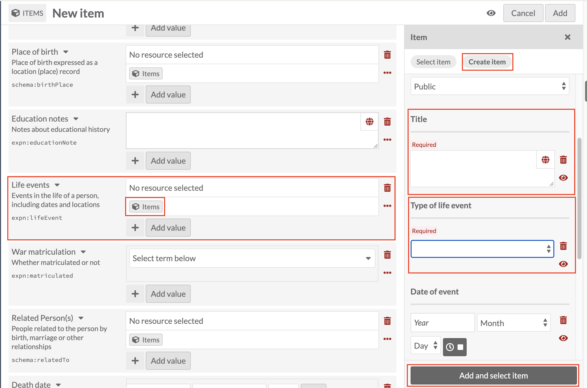
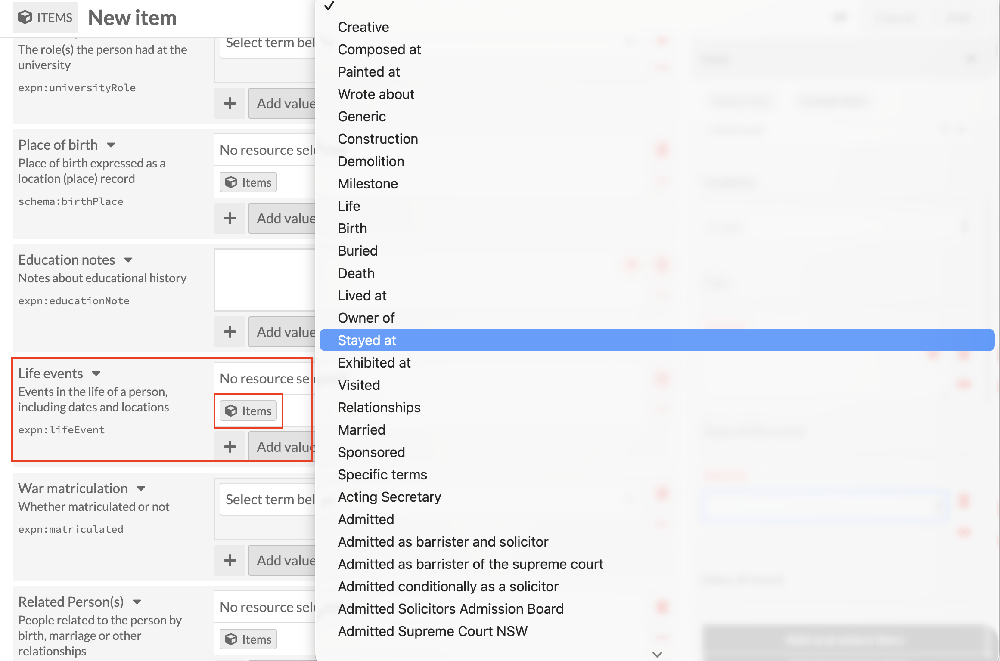

# Life events: linking a Life event record

*Part of [Adding Person Records](08-adding-person-records.md). Read
that page first for how a new record and the Person template work in
general.*

**Life events** is a catch-all field, for anything significant in a
person's life that doesn't already have its own dedicated field on the
Person template, for example moving overseas to a particular country,
taking up a board position at a company, and events like that. A few kinds of event
*do* have their own dedicated field elsewhere on the form: birth,
death, and relationships all do. Those should never be added here
instead, even though the Life events field is technically capable of
recording any of them. See "Which field for which event?" below for the
full picture, and why it matters.

## Adding a Life event

Click the Items icon under **Life events**, then **Create item**, and
set **Resource template** to **Life event** (Class fills in as
`LifeEvent`).

Title is required, and follows the same
**[Family name], [Initials] : [what the record is about]** format
introduced under
[Early education](09-adding-person-records-early-education.md), so this
record can be traced back to the Person it belongs to.

**Type of life event** is also required, and is a controlled dropdown
rather than free text. Pick the closest match from the list.

Note that this list includes **Birth**, **Death** and **Relationships**
among the options. It's technically possible to record any of them
this way. Don't: use the Person template's dedicated
[Birth](15-adding-person-records-birth.md),
[Related persons](13-adding-person-records-related-persons.md), and Death
fields instead, for the reasons covered below.

Once Title and Type of life event are done, click **Add and select
item** as before. If a person has more than one Life event to record,
use the **+** button beneath the field (next to **Add value**) to add
another. Each one creates and links a separate Life event record, the
same way.

## Some examples

Things that belong under Life events: the person moved overseas to a
particular country; the person became a board member of a company;
the person was awarded an honorary doctorate. Anything notable that
doesn't already have a dedicated field of its own on the Person
template is fair game here.

## Which field for which event?

Birth, Death, Related persons, Life events and Other events can look
interchangeable when you're deciding where to record something. Use
this table to check you're in the right place before creating a
record:

| Event | Use this field | Resource template |
|---|---|---|
| Birth | [Birth](15-adding-person-records-birth.md) | Life event |
| Death | [Death](21-adding-person-records-death.md) | Death |
| A relationship to another person (marriage, and so on) | [Related persons](13-adding-person-records-related-persons.md) | Relationship |
| Something else notable in the person's life | Life events (this page) | Life event |
| Something else notable that specifically involves another named person or organisation | [Other events](20-adding-person-records-other-events.md) | Eventlet |
