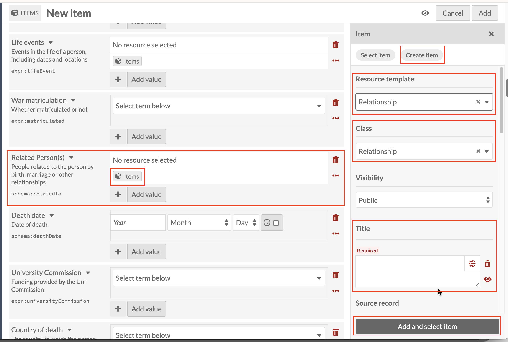
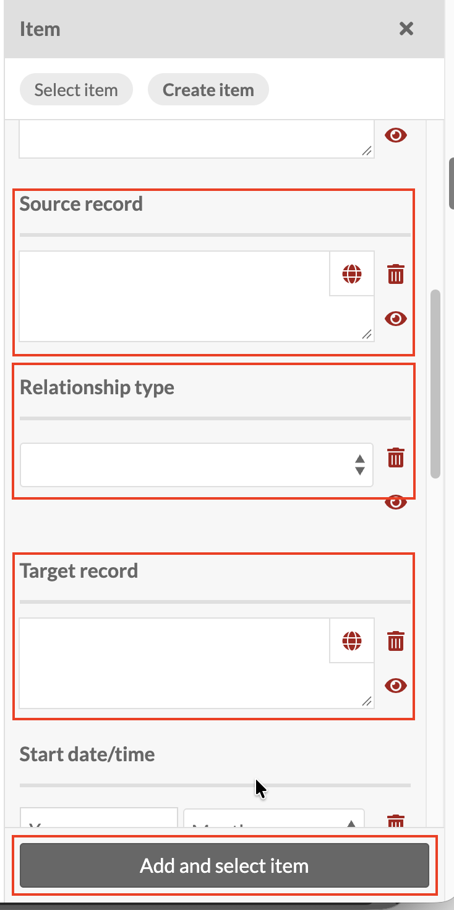

# Related persons: linking a Relationship record

*Part of [Adding Person Records](08-adding-person-records.md). Read
that page first for how a new record and the Person template work in
general.*

This field actually appears **twice** on the Person form, under two
slightly different labels, **Related Person(s)** and **Related
persons**, backed by two different properties, `schema:relatedTo` and
`expn:relatedPerson`. The steps are identical whichever of the two you
use, so this guide only walks through it once.

Before you start, one thing to have in place first: the person you're
connecting to needs their own record already: either a full **Person**
record, or the lighter **Associated person** template (a "person-lite"
record for cases that don't need a full profile). See
[Person vs Associated Person](23-person-vs-associated-person.md) for
when to use which. For now, just know one of the two has to exist
before you link to it.

Click the Items icon next to Related Person(s) (or Related persons),
then **Create item**, and set **Resource template** to **Relationship**
(Class fills in to match, as before).

The Relationship record has two fields that link out to other records:
**Source** and **Target**. Omeka doesn't enforce a direction between
them, but for consistency across the collection, treat them this way:

- **Source**: the record you're working from, i.e. the Person you're
  currently building.
- **Target**: the other person in the relationship, the one you're
  linking to.

Use the Items icon on each to select the appropriate existing Person or
Associated person record (not to create a new one: both people in the
relationship should already exist as their own records before you link
them here).

Between Source and Target sits a third field, **Relationship type**: a
dropdown covering more than marriage, it also covers relationships
such as parent and child, alongside spouse relationships like
wasWifeOf. Choose whichever one describes how Source relates to
Target.

Title on a Relationship record follows a different pattern from every
other sub-record in this guide. Rather than the
**[Family name], [Initials] : [detail]** pattern from
[Early education](09-adding-person-records-early-education.md), it's
**[relationship type] : [Source name] >> [Target name]**, for
example `wasWifeOf : Thomas, Joan Marie >> Thomas, John Victor`. The
relationship type spelled out in Title should match whatever was
chosen in the Relationship type field above (a single word,
capitalised mid-word: `wasWifeOf`, `isHusbandOf`, and so on), followed
by the Source person's name, then `>>`, then the Target person's name.

It's worth noting that a Relationship record's Source and Target
fields already link directly back to both people involved, so unlike
Schooling, Tertiary study, Place or Life event, there's no back-link
problem here that the Title needs to work around on its own. But the
existing data still spells both names out in Title as well, so this
guide follows that same convention for consistency with what's already
in the collection.

Once Relationship type, Source, Target and Title are done, click
**Add and select item** as before.

## Which field for which event?

Birth, Death, Related persons, Life events and Other events can look
interchangeable when you're deciding where to record something. Use
this table to check you're in the right place before creating a
record:

| Event | Use this field | Resource template |
|---|---|---|
| Birth | [Birth](15-adding-person-records-birth.md) | Life event |
| Death | [Death](21-adding-person-records-death.md) | Death |
| A relationship to another person (marriage, parent and child, and other relationship types) | Related persons (this page) | Relationship |
| Something else notable in the person's life | [Life events](12-adding-person-records-life-events.md) | Life event |
| Something else notable that specifically involves another named person or organisation | [Other events](20-adding-person-records-other-events.md) | Eventlet |
