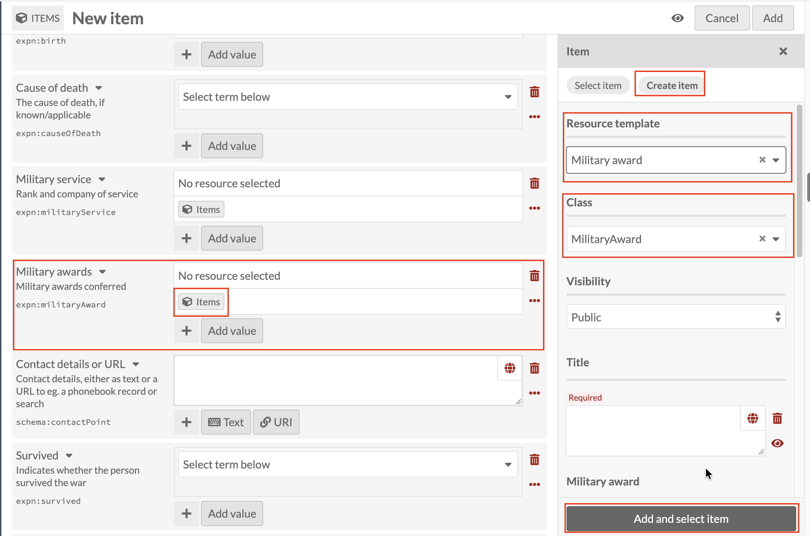

# Military awards: linking a Military award record

*Part of [Adding Person Records](08-adding-person-records.md). Read
that page first for how a new record and the Person template work in
general.*

**Military awards** follows the same pattern as
[Military service](16-adding-person-records-military-service.md), with a
different resource template. Click the Items icon under
**Military awards**, then **Create item**, and set **Resource
template** to **Military award** (Class fills in as `MilitaryAward`).

Title is required, and, exactly as with every other linked sub-record
in this guide, it's what ties this record back to the Person it
belongs to. Use the same **[Family name], [Initials] : [what the
record is about]** pattern introduced under
[Early education](09-adding-person-records-early-education.md), for
example `Smith, J.H. : British War Medal`. Below Title, **Military
award** is optional, for naming the specific award itself.

Once Title (and Military award, if you want it) is done, click **Add
and select item** as before.
