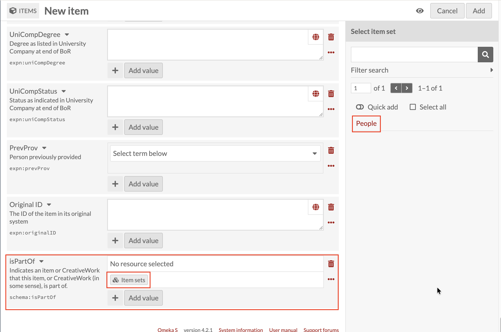
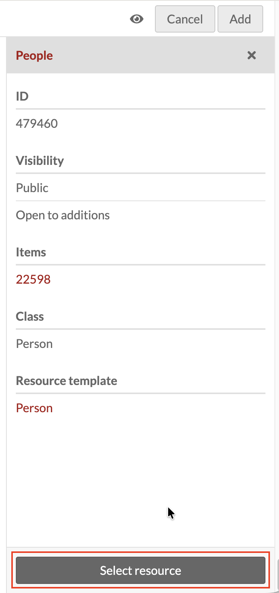

# Making a Person Findable: linking a record to the People item set

*Part of [Adding Person Records](08-adding-person-records.md). Read
that page first for how a new record and the Person template work in
general.*

**isPartOf** is the last field on the Person "Add Item" screen, and it
works differently from every field covered so far in this section.
Early education, Life events, Related persons, and the rest all use
the Items icon to link to another *item* (see
[Adding Person Records](08-adding-person-records.md)). isPartOf links
to an **item set** instead, so it uses a different icon: this guide
calls it **the Item-sets icon**. It's the one field on the whole
Person template that behaves this way (see also
[Item Sets](05-item-sets.md)).

Click the Item-sets icon under **isPartOf**. Unlike the fields above,
there's nothing to create here, this is always a matter of selecting
an item set that already exists, never making a new one. A **Select
item set** panel opens on the right, with a search box, a Filter
search option, pagination, and Quick add / Select all controls.

Find **People** in the results list and click it. This opens a
confirmation panel showing that item set's own details: its ID,
Visibility (Public / Open to additions), Items count (how many
records already belong to it), and its own Class and Resource
template (both **Person**, since this item set is specifically a
collection of Person records).

Click **Select resource** at the bottom of that panel to confirm.
isPartOf now shows **People** in place of "No resource selected."

## Why this has to be done for every Person record

Belonging to an item set in Omeka S isn't automatic. A record only
becomes part of an item set when something explicitly links it there,
and for a Person record, isPartOf is that link. As
[Viewing Person Records](07-viewing-person-records.md) covers, the
People item set's **Linked resources** tab lists every item connected
to it through isPartOf, and that's what makes it possible to browse
every person profile in the collection without wading through Life
events, Places, and every other supporting record.

A new Person record still exists, and is still reachable through the
general Items screen, if isPartOf is left as "No resource selected."
But it won't show up under People's Linked resources or View items,
and it won't count toward that item set's total. Set isPartOf to
People, using the steps above, every time a new Person record is
created, so it's always findable through the People item set rather
than only by searching for it directly.
