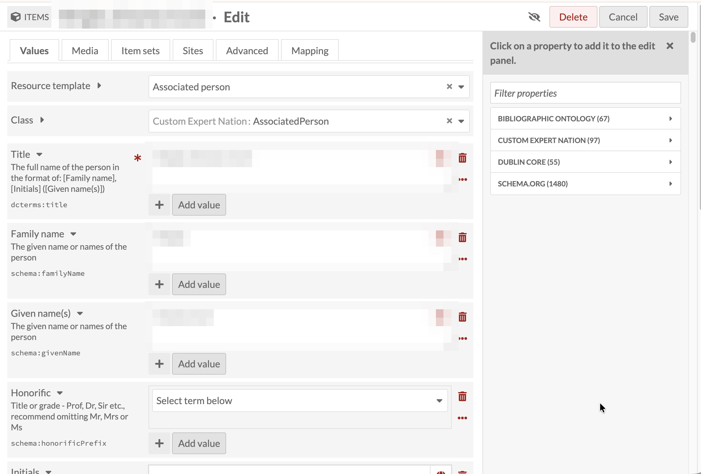
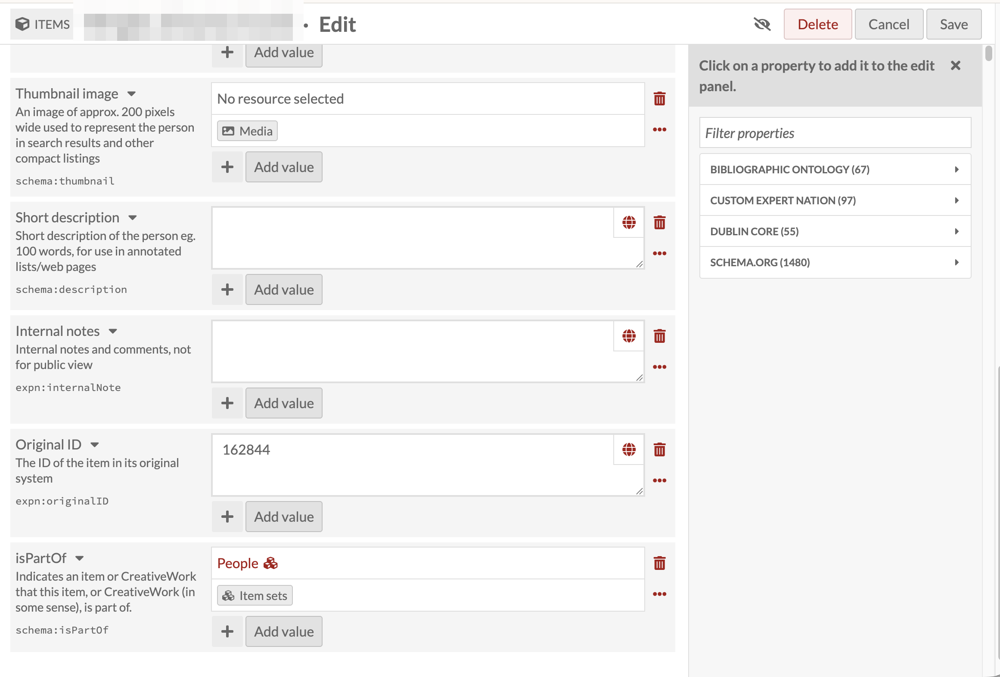

# Person vs Associated Person

**Associated person** is a second, much smaller resource template
(Class `Custom Expert Nation: AssociatedPerson`) for recording someone
without giving them a full Person record. It appears designed with one
case in mind, a spouse who doesn't need their own biography, but in
practice it isn't limited to that: use it for anyone who needs to be
linked to *as* a person without the full Person template behind them.

Its fields are a small subset of the Person template's: Title (required,
following the same **[Family name], [Initials] ([Given name(s)])**
pattern as Person, for example `Wright, C.C. (Charles Cecil)`), Family
name, Given name(s), Honorific, and Initials, plus the same Thumbnail
image, Short description, Internal notes, and Original ID fields that
appear on every record type in this collection.

Like a Person record, an Associated person record also has an
**isPartOf** field, and it's set to **People** the same way (see
[Making a Person Findable](22-adding-person-records-making-a-person-findable.md)),
so Associated person records turn up alongside full Person records when
browsing that item set.

## Where it fits in

The place this choice actually comes up is
[Related persons](13-adding-person-records-related-persons.md): before
linking a Relationship record, the other person in it needs to already
exist as either a full Person record or an Associated person record.
If that person is significant enough to warrant their own biography,
create a full Person record for them as usual. If not, an Associated
person record is enough to give them an identity to link to.
