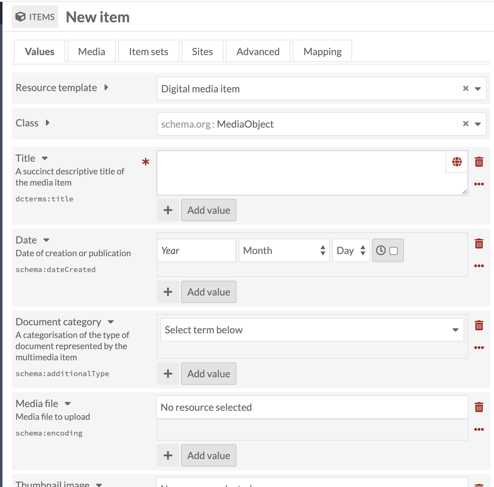
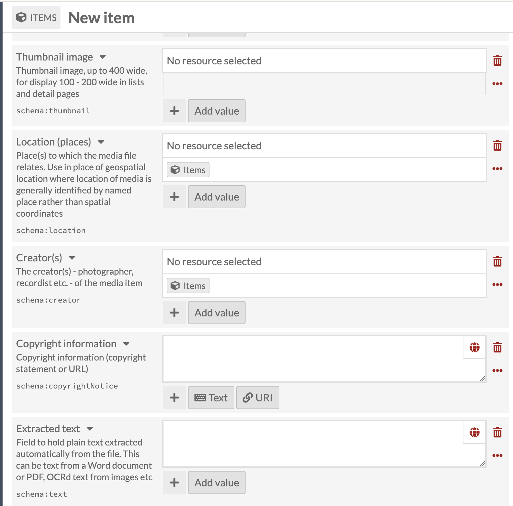
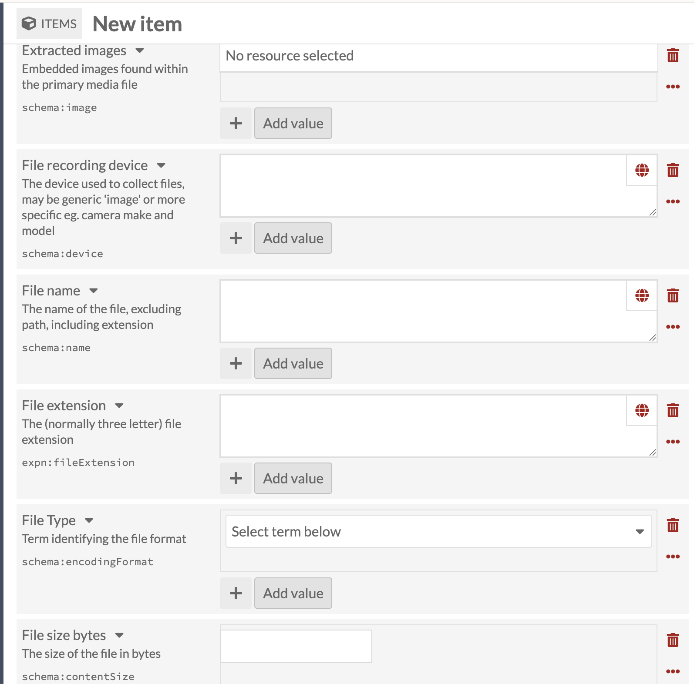
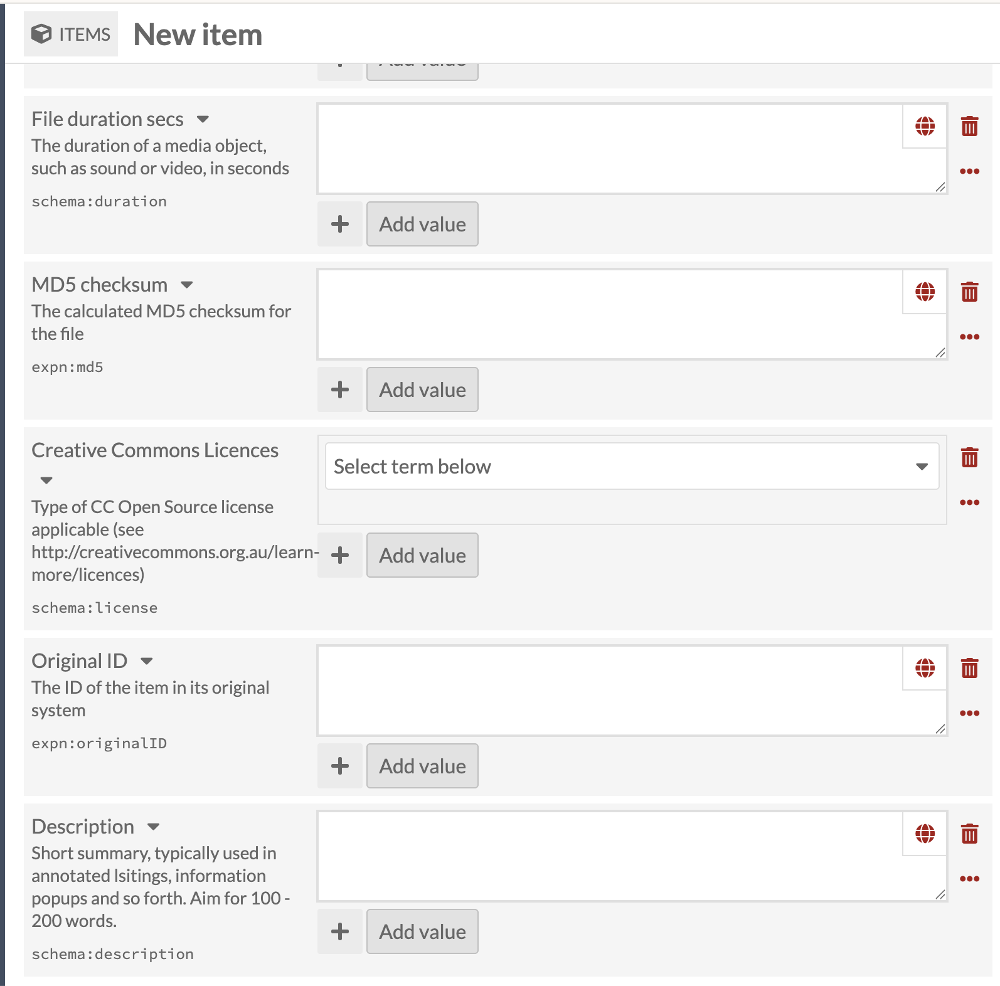
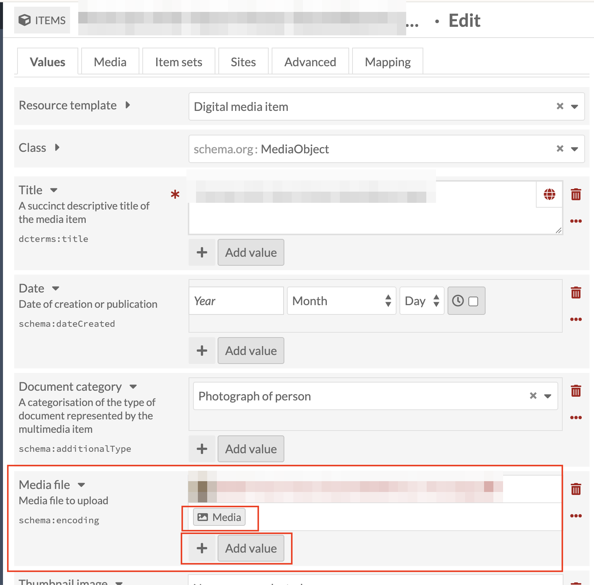
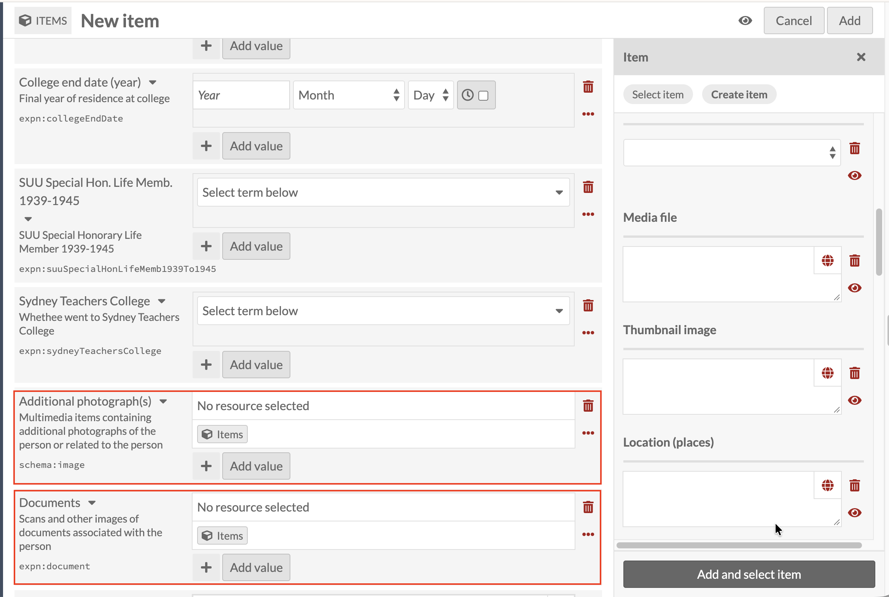
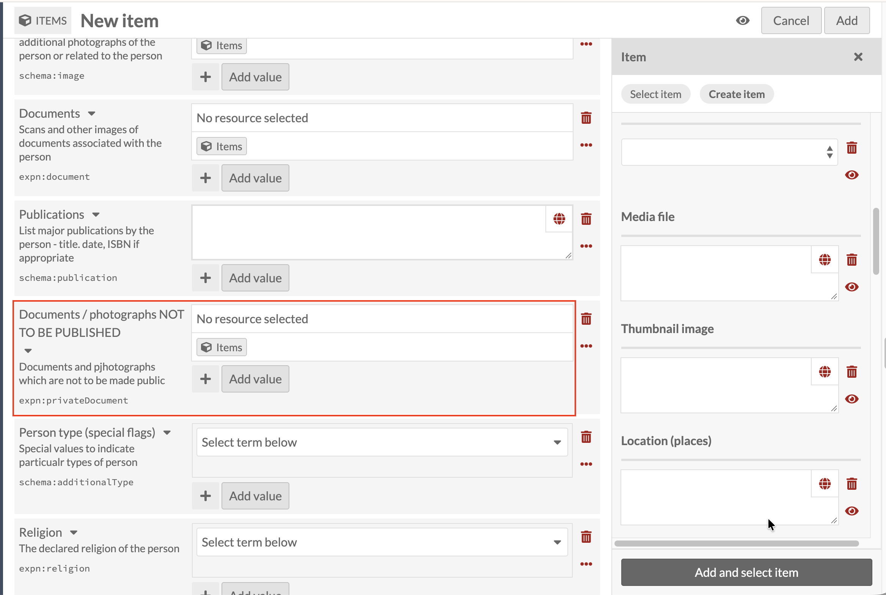

# Adding media items

> **Note:** attaching media doesn't currently work properly; this is expected to be fixed.

Every media field on the Person template (Thumbnail image, Additional
photograph(s), Documents, Documents / photographs NOT TO BE PUBLISHED,
PDF of book entry) uses the same resource template: **Digital media
item** (Class `schema.org: MediaObject`). This page walks through that
template in full, in the order its fields appear, then shows where it
connects to the Person template and why that connection doesn't
currently work.

## The Digital media item template

### Identity and category

| Field label | Property | Notes |
|---|---|---|
| Resource template | N/A | Digital media item |
| Class | N/A | Fills in automatically to `schema.org: MediaObject` |
| Title | `dcterms:title` | Required. The one real example seen so far in the collection uses a `[description of subject] [ file type ]` pattern, e.g. "Portrait of Dr Henri Victor David Baret [ jpg ]" |
| Date | `schema:dateCreated` | Date of creation or publication |
| Document category | `schema:additionalType` | Dropdown; "Photograph of person" is one confirmed value |
| Media file | `schema:encoding` | See below: this is the field a real file gets attached through |

**Media file** works differently from every other field on this page,
and differently from the Items-icon fields used everywhere else in
this guide. It doesn't use the Items icon at all; instead it has its
own small **Media** button, covered in detail below.

### Descriptive fields

| Field label | Property | Notes |
|---|---|---|
| Thumbnail image | `schema:thumbnail` | Items icon; links to another item |
| Location (places) | `schema:location` | Items icon; only relevant when the media itself depicts or relates to a specific place |
| Creator(s) | `schema:creator` | Items icon; photographer, recordist, etc. |
| Copyright information | `schema:copyrightNotice` | Text or URI; a copyright statement or a link to one |
| Extracted text | `schema:text` | Plain text extracted from the file (OCR'd text from a PDF or scanned image, for example) |

### Technical file fields

| Field label | Property | Notes |
|---|---|---|
| Extracted images | `schema:image` | Items icon; images embedded within the primary file |
| File recording device | `schema:device` | Generic ("image") or specific (camera make and model) |
| File name | `schema:name` | The file's name, excluding path, including extension |
| File extension | `expn:fileExtension` | Normally three letters |
| File Type | `schema:encodingFormat` | Dropdown; the file format |
| File size bytes | `schema:contentSize` | N/A |

### File details and licensing

| Field label | Property | Notes |
|---|---|---|
| File duration secs | `schema:duration` | Only meaningful for a video or audio file |
| MD5 checksum | `expn:md5` | The calculated checksum for the file |
| Creative Commons Licences | `schema:license` | Dropdown of CC licence types |
| Original ID | `expn:originalID` | The same legacy-system-ID convention used on Person and Associated person |
| Description | `schema:description` | Short summary, 100–200 words, for annotated listings |

That covers both copyright-related fields on this template:
**Copyright information** for a specific copyright statement or link,
and **Creative Commons Licences** for a controlled-vocabulary CC
licence type. They're independent of each other: a media item can
carry either, both, or neither.

## What a working record looks like

This is the one already-catalogued record found so far that has both
a real file attached and its template fields filled in (name and file
name blurred, as this is a real record):

On this record, a file has been attached using Omeka's own **Media**
tab, the tab labelled **Media**, next to **Values**, at the top of the
item's edit screen (the same tab pattern seen on every item's edit
screen in this guide, for example back on
[Person vs Associated Person](23-person-vs-associated-person.md)). The
**Media file** field's small **Media** button (a different icon from
the Items icon used everywhere else in this guide) shows that file's
thumbnail and name as its value. That button is a picker: it collects
files already attached to this item so one of them can be chosen for
this field. Adding a media item in the first place doesn't necessarily
happen through that button, and once attaching media works properly,
it's this button the field will link to.

Document category was also set by hand on this record ("Photograph of
person"). Most fields below Media file are still blank here; filling
them in is optional and this one example doesn't show every field in
use.

The highlighted **+ Add value** control under Media file works the
same way it does on every field in this guide: it adds another
instance of the field, so more than one media file can be attached
here when needed.

## Where this shows up in the Person template

The Items icon next to any of the Person template's five media fields
opens the same choice used everywhere else in this guide: **Select
item** or **Create item**.

**Create item** here opens a stripped-down version of the Digital
media item template: only its Values, in a side panel, with no tabs
along the top. There's no **Media** tab visible in this panel, and
Media file shows up as a plain text box with no **Media** button next
to it. Uploading a file should technically be possible from here, or
from the Digital media item template's own edit screen (see above); in
practice neither currently works properly, so a record created this
way ends up as metadata only, with no file behind it.

**Select item** doesn't help either: with 100,000+ items in this
collection and inconsistent titling, a title search cannot reliably
find a specific existing media item, even one that does have a real
file attached.

## Not every field applies to every use

The same Digital media item template backs all five of the Person
template's media fields, but which of its fields actually matter
depends on what kind of file is involved:

| Person field | Typical file | Fields most worth filling in |
|---|---|---|
| Thumbnail image | Image | Media file, File Type |
| Additional photograph(s) | Image | Media file, Document category, Creator(s), Copyright information, File Type |
| Documents | PDF or scanned image | Media file, Document category, Extracted text, Extracted images, File Type |
| Documents / photographs NOT TO BE PUBLISHED | PDF or image | Same as Documents or Additional photograph(s) above |
| PDF of book entry | PDF | Media file, Extracted text, File Type |

File duration secs only ever applies to audio or video, which none of
the five Person media fields are described as expecting, but the
field exists on the template for when one is. File recording device,
File name, File extension, File size bytes and MD5 checksum are
technical, largely automatic details rather than something to fill in
by hand for every item; useful when present, not something to chase
down manually. Location (places) only applies when the media itself
shows or relates to a specific place, not to every item.

## The underlying problem

This gap (no way to attach a real file and keep the template
populated together, from inside a Person record or otherwise) is
logged in the tech issues tracker as the most urgent open item, along
with what's been found about how the existing media in this
collection was ingested. See that log for the full technical detail
and the open questions for the tech team.
