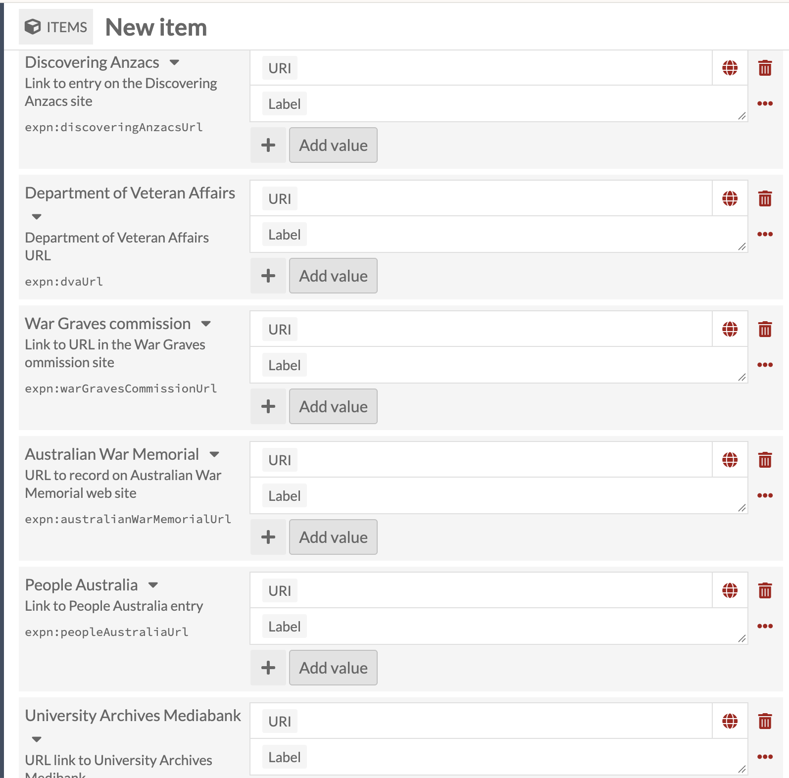

# Adding links to other resources outside Omeka (URI links)

A handful of fields on the Person template don't link to another item in
this collection at all, and don't use the Items icon. Instead they hold a
**URI**: a web address pointing to a record for the same person somewhere
else entirely, on a specific external site.

## URI fields on the Person template

| Field label | Property | Notes |
|---|---|---|
| Contact details or URL | `schema:contactPoint` | General purpose; a Text/URI toggle lets this one hold plain text or a link |
| URL(s) | `schema:url` | General purpose; appears earlier on the form, among the "Other events" fields |
| Discovering Anzacs | `expn:discoveringAnzacsUrl` | Link to entry on the Discovering Anzacs site |
| Department of Veteran Affairs | `expn:dvaUrl` | Department of Veteran Affairs URL |
| War Graves commission | `expn:warGravesCommissionURL` | Link to URL on the War Graves Commission site |
| Australian War Memorial | `expn:australianWarMemorialUrl` | URL to record on the Australian War Memorial web site |
| People Australia | `expn:peopleAustraliaUrl` | Link to People Australia entry |
| University Archives Mediabank | `expn:universityArchivesMediabankUrl` | URL link to University Archives Mediabank |
| Other URLs | `expn:otherUrl` | General purpose, for a site not covered by any of the named fields above |

Contact details or URL and URL(s) are general purpose. The other six,
plus Other URLs, are each tied to one specific external site, and the
six named-site fields appear together near the end of the Person "Add
Item" screen.

## What a "URI + label" field looks like

This is the six named-site fields as they appear on the New item
screen: a **URI** box and an optional **Label** box for each, with no
toggle, only a link goes in.

## Filling one in

- Paste the full web address of that person's page on the named site
  into **URI**, most likely found by searching that site for the
  person by name.
- **Label** is optional: whatever text is typed there is what displays
  as the clickable link text, instead of the raw URL.
- **+ Add value**, underneath the field, adds another URI/Label pair to
  the same field, for a person with more than one entry on the same
  site.
