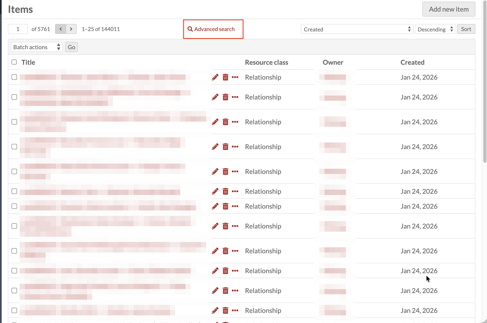
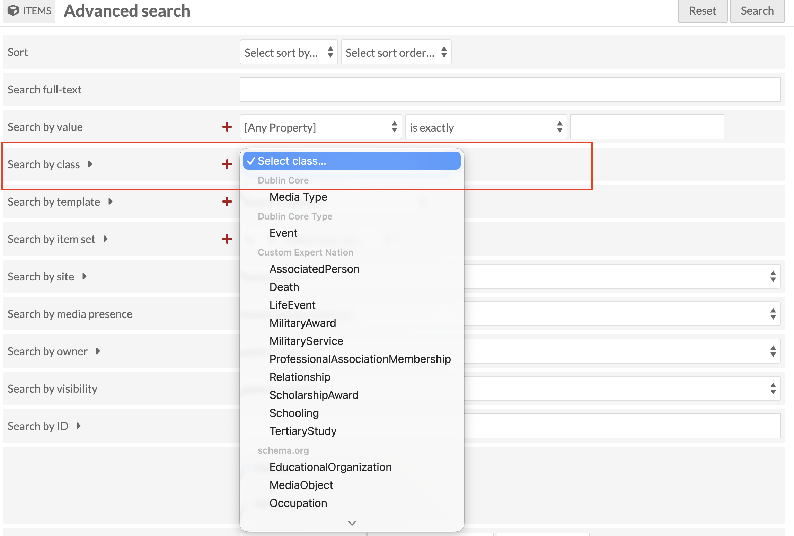
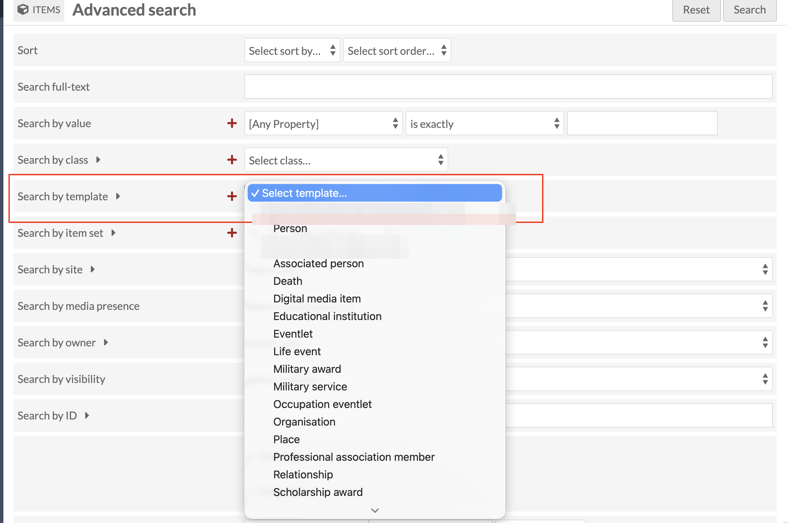

# Advanced Queries

Advanced search is most useful in this collection for narrowing by
**class** or by **resource template**, rather than for keyword or
value search.

## Where to find it

From the main Items screen, click **Advanced search**, next to the
page count near the top.

## Searching by class

**Search by class** narrows results to every item carrying a
particular Class, drawn from the vocabularies in use across the
collection (Dublin Core, Custom Expert Nation, schema.org, and so
on), regardless of which resource template created them.

## Searching by resource template

**Search by template** narrows results to items created with one
specific resource template (Person, Associated person, Life event,
and the rest), listed here grouped by the account that created each
one.

For the full label-to-property lookup table, see the
[Quick reference guide](28-quick-reference-guide.md).
