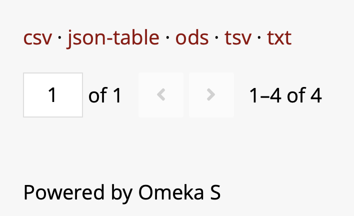

# Exporting records

This feature hasn't been enabled yet on Expert Nation Omeka, so the
screenshot below is from a different Omeka S site, showing what it
looks like once turned on.

Once enabled, exporting will be public facing: anyone browsing the
site, not just logged-in staff, will be able to select records and
export them. The export links appear at the bottom of a page of
records, following the results themselves, offering a choice of
format: CSV, JSON table, ODS, TSV, or plain text.

