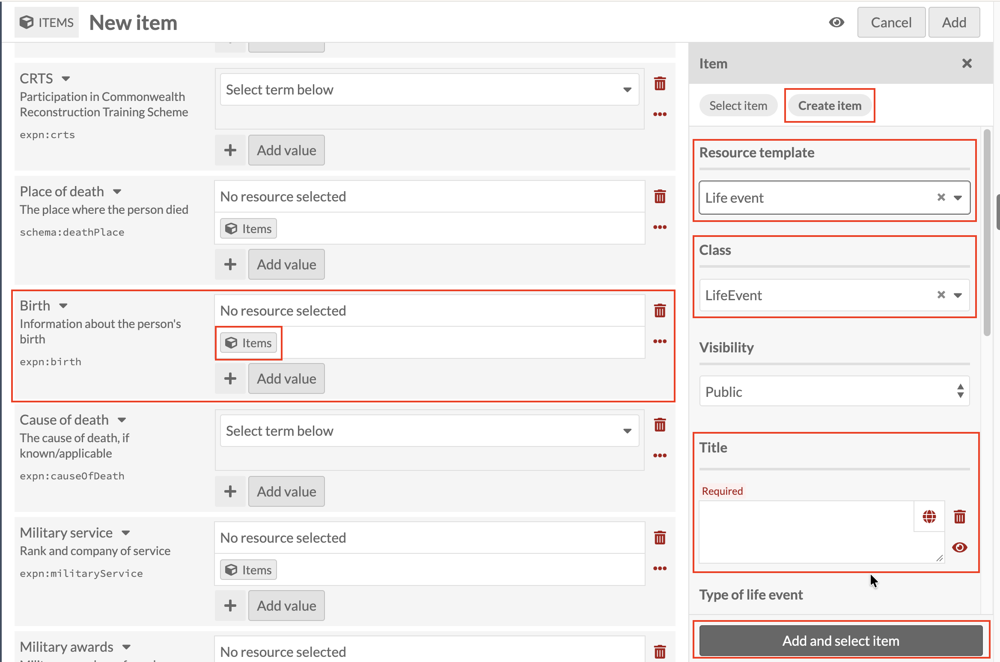
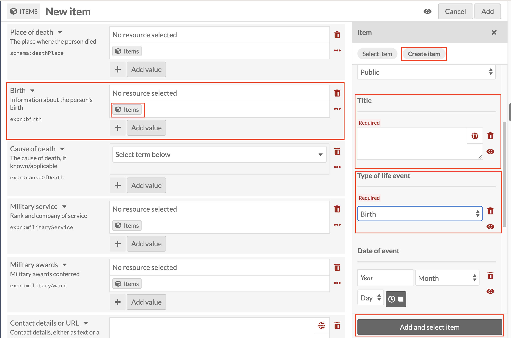

# Birth: linking a Life event record

*Part of [Adding Person Records](05-adding-person-records.md). Read
that page first for how a new record and the Person template work in
general.*

**Birth** has its own dedicated field on the Person template, but
under the hood, it uses the same **Life event** resource template as
the general [Life events](adding-person-records-life-events.md) field
further up the form. Click the Items icon under **Birth**, then
**Create item**, and set **Resource template** to **Life event** (Class
fills in as `LifeEvent`, exactly as it does for Life events).

**Always add birth information here, through the dedicated Birth
field, never through Life events, even though the same template makes
it technically possible to do either.** Which field you use isn't just
tidiness: it decides how the record can be found and searched later.
Birth entered through this field is stored under its own property
(`expn:birth`), separately from everything stored under Life events
(`expn:lifeEvent`), so a search or export built around "find this
person's birth record" only works reliably if every birth was entered
through Birth. One added under Life events instead would be invisible
to that search, even though it looks identical on screen.

Once you've set Resource template, scroll down to **Title** and **Type
of life event**, both required. Set **Type of life event** to
**Birth**.

Title on this record is free text, exactly like every other linked
sub-record, and needs the same care: it's the only thing that shows
this Life event record belongs to this person. Use the
**[Family name], [Initials] : [what the record is about]** pattern
introduced under [Early education](adding-person-records-early-education.md),
for example `Smith, J.H. : Birth`.

Once Title and Type of life event are both filled in, click **Add and
select item** as before.
