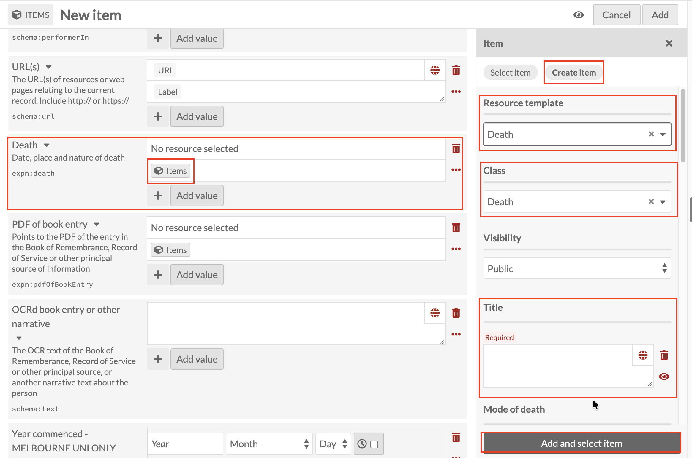

# Death: linking a Death record

*Part of [Adding Person Records](05-adding-person-records.md). Read
that page first for how a new record and the Person template work in
general.*

**Death** works the same way as every other linked field, using its
own dedicated **Death** resource template (Class fills in as `Death`).
Click the Items icon under **Death**, then **Create item**, and set
**Resource template** to **Death**.

Title is required, and follows the same
**[Family name], [Initials] : [what the record is about]** pattern
introduced under
[Early education](adding-person-records-early-education.md), for
example `Smith, J.H. : Death`.

Below Title, **Mode of death** and the record's other fields are
optional, and can be filled in with whatever detail you have.

Once Title (and whichever other fields apply) is done, click **Add
and select item** as before.

This is the last of the dedicated fields the "Which field for which
event?" table under [Life events](adding-person-records-life-events.md)
points to. Between that table and this page, Birth, Death and Related
persons are now all covered.
