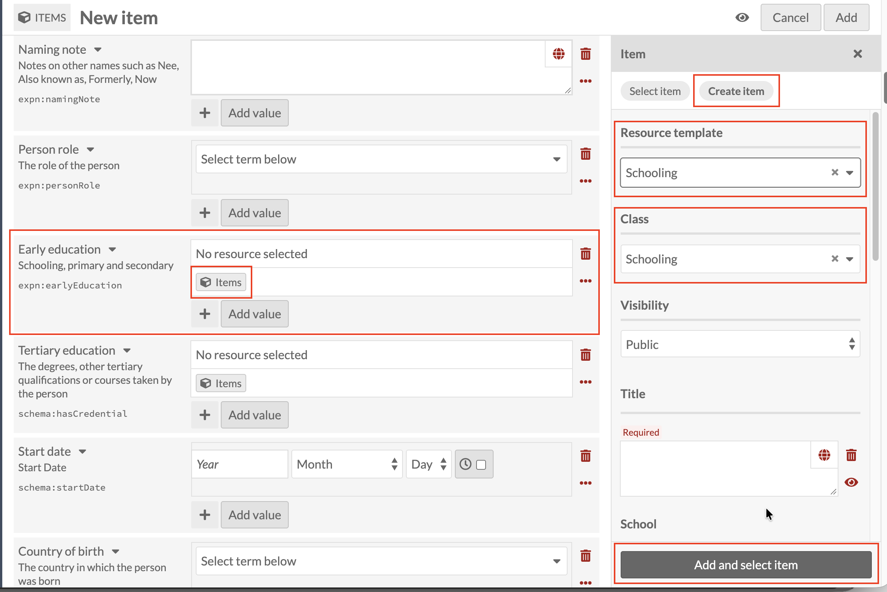
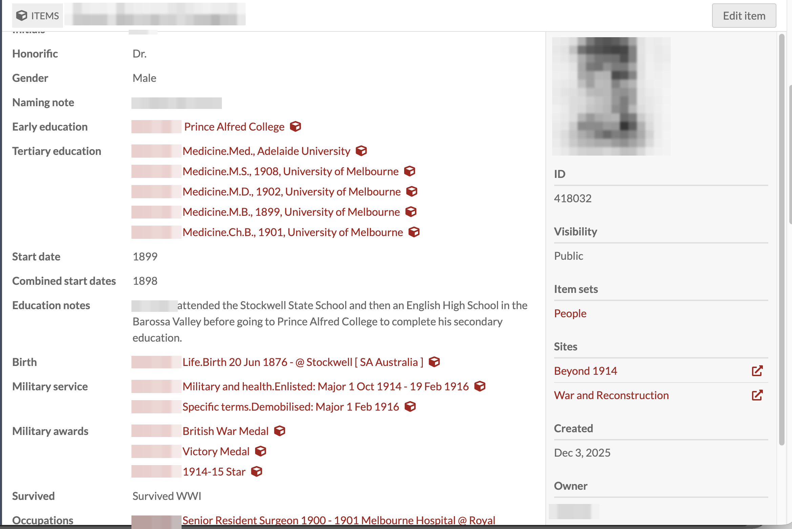

# Early education: linking a Schooling record

*Part of [Adding Person Records](05-adding-person-records.md). Read
that page first for how a new record and the Person template work in
general.*

Some fields on the Person template can't be filled in directly. Their
information lives on a separate, linked record instead. **Early
education** is the first one you'll meet on the form. Its value can only
be added through the Items icon next to the field.

Click the Items icon under **Early education**. A panel opens on the
right with two tabs: **Select item**, to link a record that already
exists, and **Create item**, to make a new one. Click **Create item**.

Set **Resource template** to **Schooling**. As before, this automatically
sets **Class** to match.

This is the point where you need to already know which resource template
pairs with which field, because nothing on the form tells you: Early
education needs Schooling, Tertiary education needs Tertiary study, and
so on for every field you'll meet in this guide. (This is a real gap:
ideally the right template would be pre-selected automatically, or at
least named in the field's own instructions. Flagged for the tech team.)

Now the important pause: this Schooling record has its own **Title**
field, required, exactly like the one on the Person record itself. The
same rule applies: whatever you type here is the only thing this
record's own screen, and any search result, will ever show. And because a
linked sub-record like this one doesn't link back to the Person it
belongs to (an outstanding issue with the tech team), it's also the only
clue, on this record alone, of whose education it is. That's not ideal,
but it's what we're working with for now, so treating the Title
carefully here matters more than it should have to.

The workaround is to always include the person's name in a linked
sub-record's Title, in the same format the existing data already uses.
Here's a real example, from a Schooling record already in this
collection (the name is blurred below, since this is a live record):

The pattern is **[Family name], [Initials] : [what the record is
about]**, so for an Early education / Schooling record, you'd type
something like `Smith, J.H. : Melbourne Grammar School`. Use this same
format for every linked sub-record you create from here on, not only
Schooling.

Once Title (and School, if you want to fill it in) is done, click **Add
and select item** at the bottom of the panel. This both creates the
Schooling record and links it into the Early education field on the
Person you're building. You'll land back on the main form with the new
record now showing where "No resource selected" used to be.
