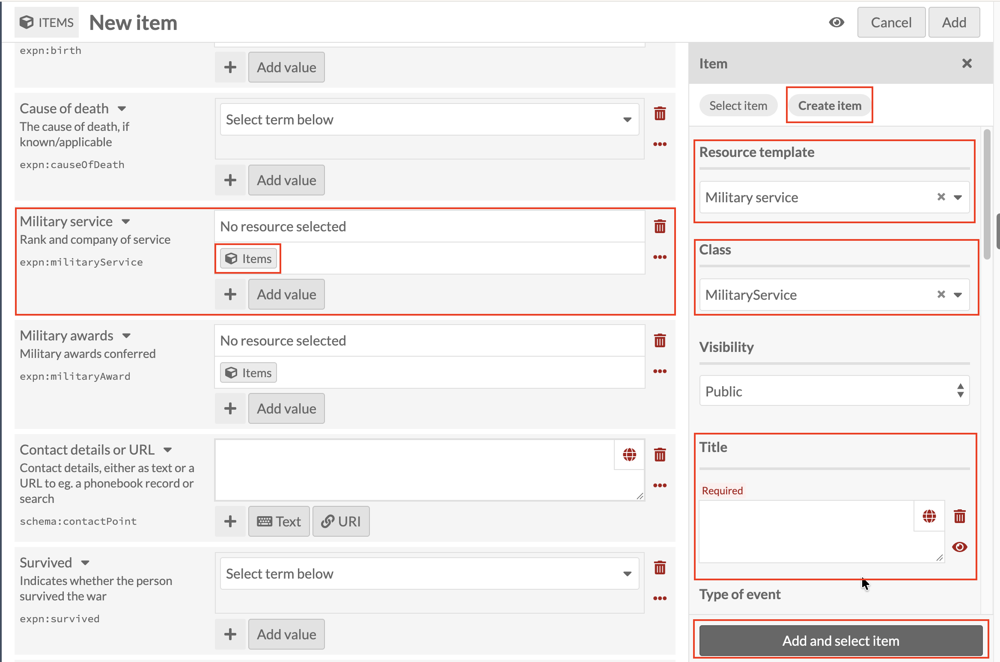

# Military service: linking a Military service record

*Part of [Adding Person Records](05-adding-person-records.md). Read
that page first for how a new record and the Person template work in
general.*

**Military service** works the same way as every other linked field so
far. Click the Items icon under **Military service**, then
**Create item**, and set **Resource template** to **Military service**
(Class fills in as `MilitaryService`).

Title is required, and, as with every linked sub-record in this guide,
it's the only thing that ties this record back to the Person it
belongs to. Use the same **[Family name], [Initials] : [what the
record is about]** pattern introduced under
[Early education](adding-person-records-early-education.md), for
example `Smith, J.H. : Private, 14th Battalion`. Below Title,
**Type of event** is optional, for noting more detail about the
service itself.

Once Title (and Type of event, if you want it) is done, click **Add and
select item** as before.
