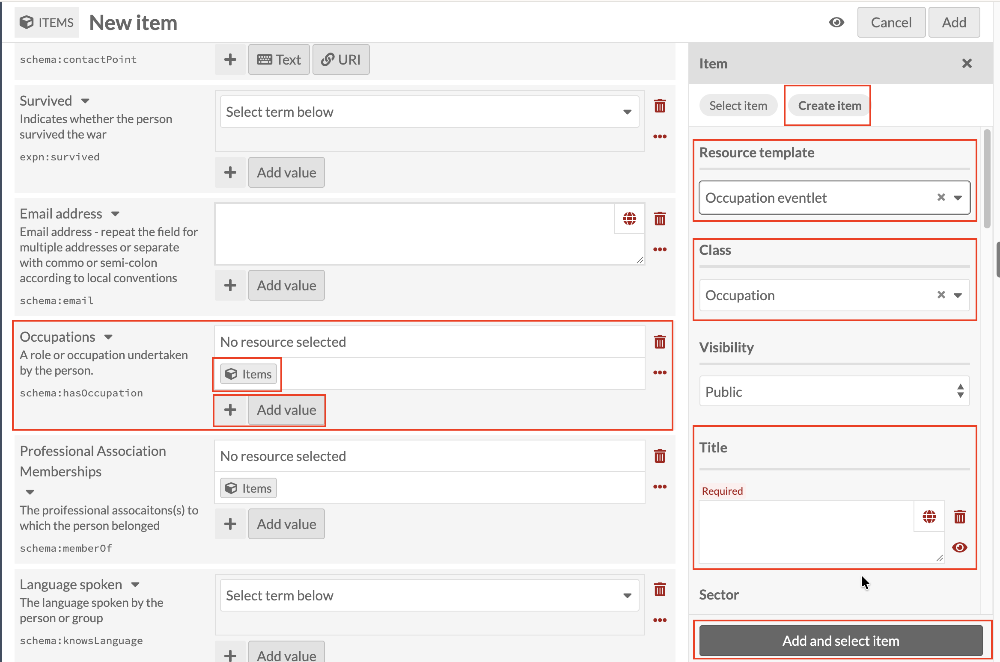
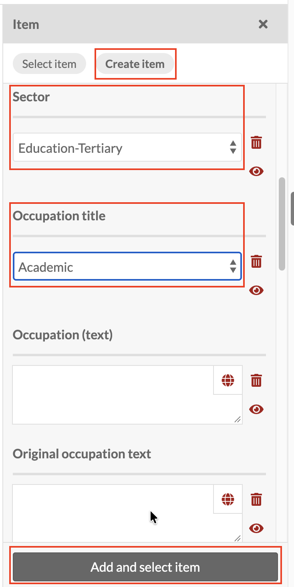

# Occupations: linking an Occupation eventlet record

*Part of [Adding Person Records](05-adding-person-records.md). Read
that page first for how a new record and the Person template work in
general.*

**Occupations** works the same way as every other linked field, using
the **Occupation eventlet** resource template. Click the Items icon
under **Occupations**, then **Create item**, and set **Resource
template** to **Occupation eventlet** (Class fills in as `Occupation`).

A person can have more than one occupation over their life, so this is
one of the fields where you'll often add several records rather than
just one. Once you've added the first Occupation eventlet, use the
**+** button next to **Add value** to add another. Each one creates
and links a separate record, the same way Life events does.

Title is required here too. Even though "eventlet" makes this sound
different from the other linked sub-records, it's still a Person's
sub-record like any other, so the same rule applies: use the
**[Family name], [Initials] : [what the record is about]** pattern
introduced under
[Early education](adding-person-records-early-education.md), for
example `Smith, J.H. : Academic`.

Below Title, **Sector** and **Occupation title** are worth noticing
because they aren't free text: they're dropdowns, drawing from a
fixed, pre-populated list (a controlled vocabulary), unlike most of
the fields covered so far. **Occupation (text)** and **Original
occupation text**, further down, are ordinary free text fields. You'll
see this same mix, some fields a fixed list, others free text, on
other sub-records too; it's always worth checking whether a field is a
dropdown or a text box before assuming you can type anything into it.

Once Title (and whichever other fields apply) are done, click **Add
and select item** as before.
