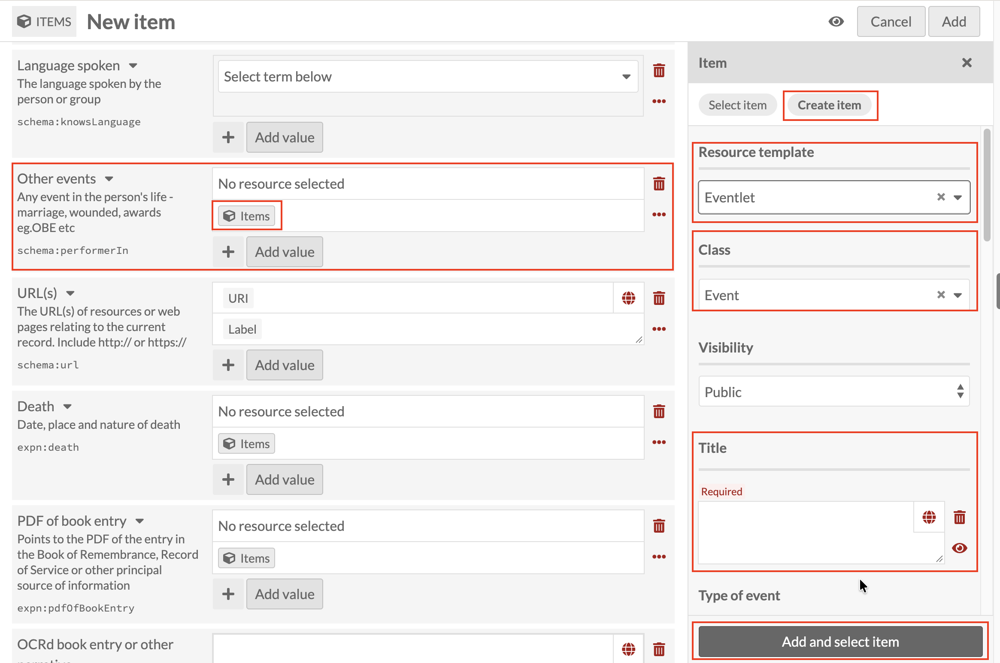
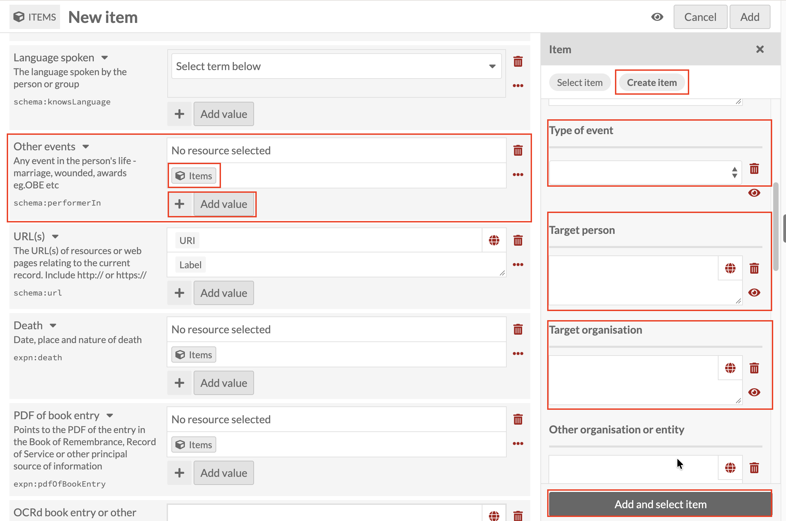

# Other events: linking an Eventlet record

*Part of [Adding Person Records](05-adding-person-records.md). Read
that page first for how a new record and the Person template work in
general.*

**Other events** is for anything in a person's life that doesn't fit
[Life events](adding-person-records-life-events.md) or one of the more
specific fields already covered. Click the Items icon under **Other
events**, then **Create item**, and set **Resource template** to
**Eventlet** (Class fills in as `Event`).

**Always use Eventlet here, never Life event.** Other
events is technically flexible enough to accept either, but using the
same template consistently is what keeps this field distinct and findable
as its own group of records; mixing the two would blur Other events
back into Life events, the same integrity problem covered under
[Life events](adding-person-records-life-events.md). (Flagged for the
tech team: Other events and Life events can currently both accept
either template, which shouldn't be possible. It's also worth a
separate conversation with researchers about whether Other events and
Life events should really be two fields and two templates at all,
given how much they overlap.)

Like Occupations and Professional Association Memberships, a person
can have several Other events, so use the **+** button next to **Add
value** to add more than one.

Title is required, and follows the same
**[Family name], [Initials] : [what the record is about]** pattern
introduced under
[Early education](adding-person-records-early-education.md), for
example `Smith, J.H. : Awarded OBE`.

Below Title, **Type of event** is a dropdown, and it draws on the
same controlled list of event types as
[Life events](adding-person-records-life-events.md)'s **Type of life
event** field. **Target person**, **Target organisation** and **Other
organisation or entity** are worth a closer look too: despite their
names, they're plain free-text fields, not Items-icon links to an
actual Person or Organisation record, so typing a name into Target
person doesn't connect this Eventlet to that person's own record the
way, say, Related persons does. Having named "person" and
"organisation" fields at all suggests Eventlet was built with a
specific use in mind: recording who or what an event involved,
beyond just the Person it belongs to, even though right now that's
captured as text rather than a real link.

Once Title (and whichever other fields apply) are done, click **Add
and select item** as before.
