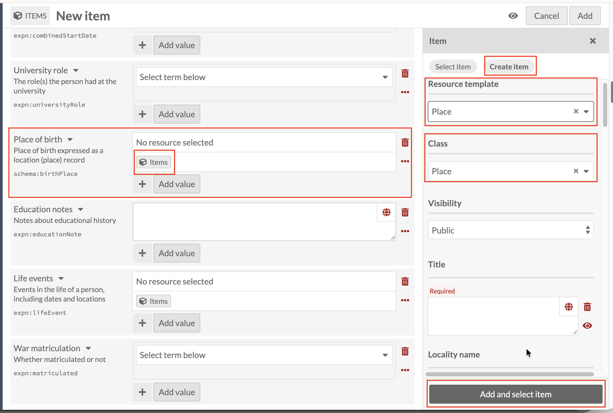
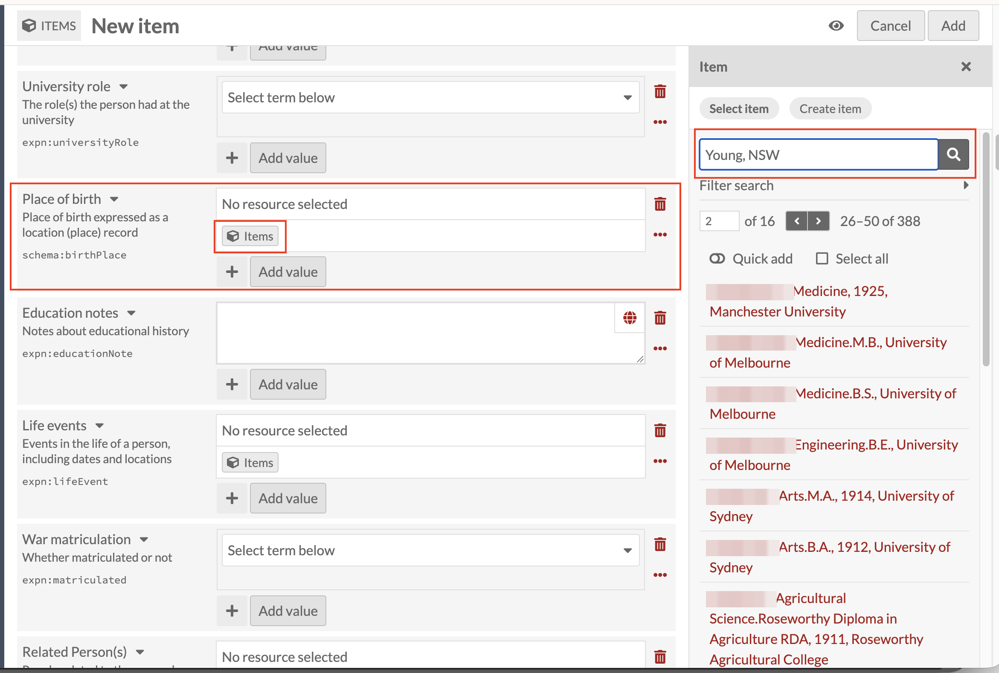
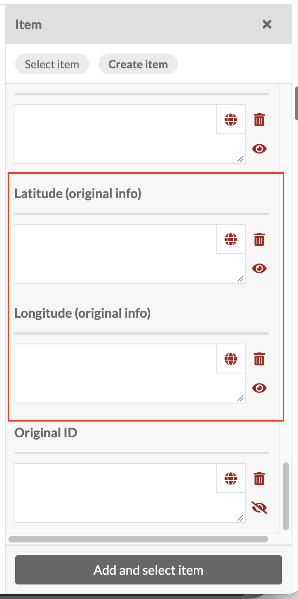

# Place of birth: linking a Place record

*Part of [Adding Person Records](05-adding-person-records.md). Read
that page first for how a new record and the Person template work in
general.*

**Place of birth** works the same way again: Items icon, then
**Create item**. But it comes with a problem worth understanding before
you use it.

Set **Resource template** to **Place**. As with every other linked
field, Title is required, and follows the same
**[Family name], [Initials] : [what the record is about]** pattern,
for example, `Smith, J.H. : Ballarat, Victoria`.

Here's the problem: a place should really be a fixed, shared list, one
record for Ballarat, reused by everyone born there, but the Place
template doesn't work that way. There's no controlled vocabulary and no
lookup behind it, so **Select item** doesn't reliably surface a place
that's already been entered, even when it exists. In practice, this
means the same place can end up created over and over: "Ballarat" typed
in by hand a different time for every person born there, as separate,
duplicate records with no connection to each other. (Flagged for the
tech team: Place needs either a controlled list to select from, or a
working search over existing Place records, so cataloguers can reuse
one Ballarat instead of creating a new one every time.)

The **Select item** tab shows what this ideally looks like: searching
there does return a results list of existing records, in the same
Title format used throughout this guide (names blurred below, as these
are real records).

That's the behaviour Place should have: search, find an existing
record, reuse it. It just isn't reliable enough yet to depend on.

One thing the Place template does offer, further down the panel: fields
for **Latitude (original info)** and **Longitude (original info)**. If
you add coordinates here, the place becomes viewable on a map, through
the **Mapping** tab elsewhere in the system, so even with the
duplication problem above, it's worth filling these in when you have
the coordinates to hand.

Once Title (and Latitude/Longitude, if you have them) is done, click
**Add and select item** as before.
