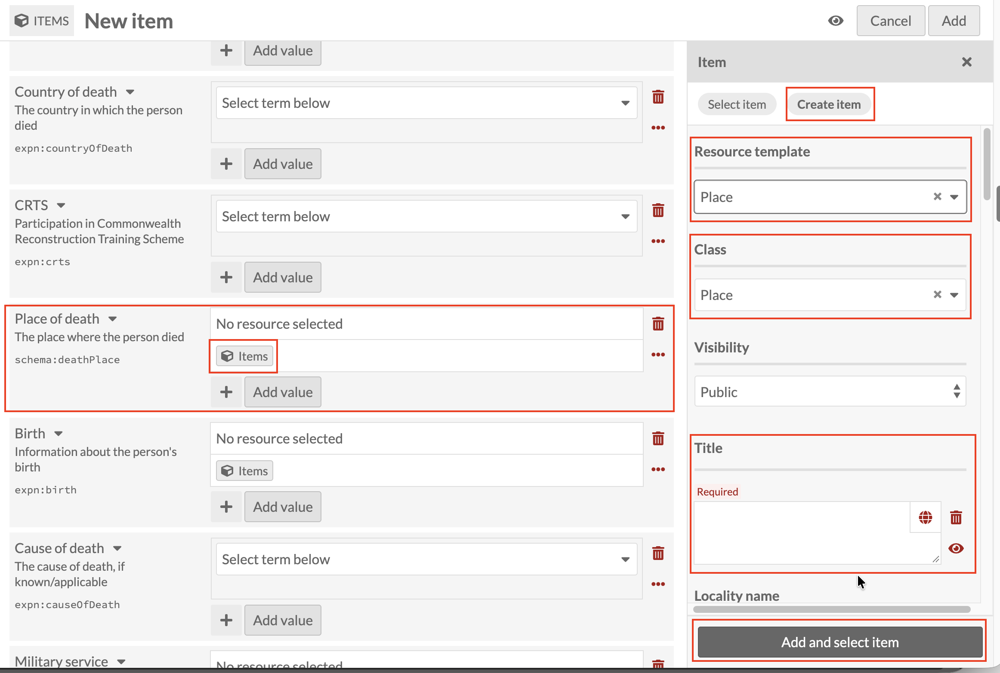
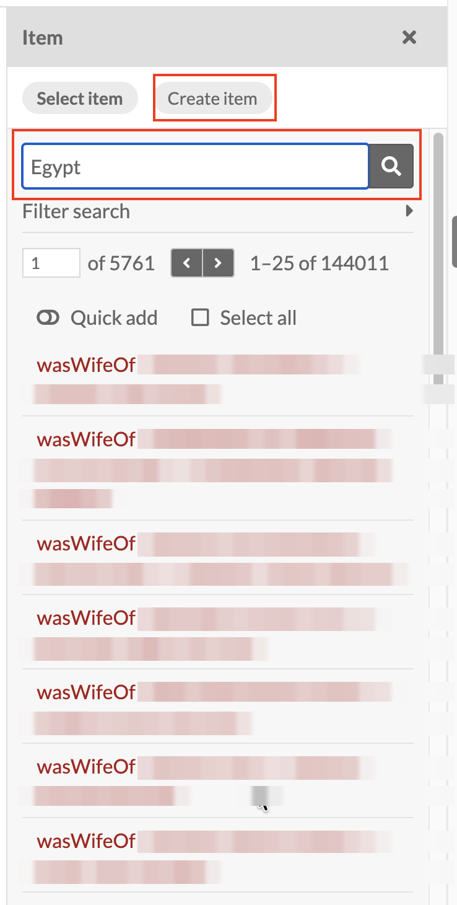
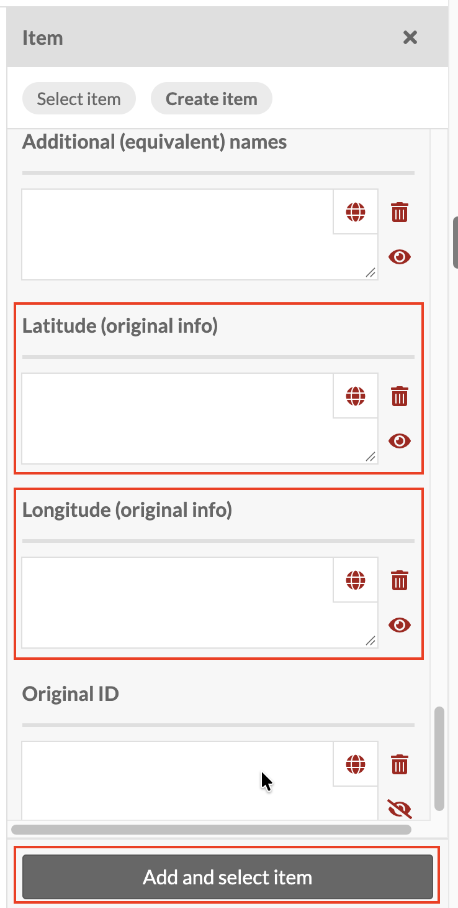

# Place of death: linking a Place record

*Part of [Adding Person Records](05-adding-person-records.md). Read
that page first for how a new record and the Person template work in
general.*

**Place of death** uses the same **Place** resource template as
[Place of birth](adding-person-records-place-of-birth.md), and
everything covered there applies here too: Title is required and
follows the **[Family name], [Initials] : [what the record is about]**
pattern, and the same controlled-vocabulary problem applies: there's no
fixed list of places to choose from, so the same place can end up
created multiple times over.

Click the Items icon under **Place of death**, then **Create item**, and
set **Resource template** to **Place** (Class fills in to match).

Searching under **Select item** shows the same problem again. Here,
searching for a real place ("Egypt") doesn't return matching Place
records at all. Instead it returns a huge, unfiltered list of unrelated
records (over 144,000 of them), starting with a run of **Relationship**
records whose Title happens to follow the pattern covered under
[Related persons](adding-person-records-related-persons.md): the
relationship type, then the two people it connects (names blurred
below, as these are real records):

That's a stronger version of the same issue flagged under Place of
birth: search here isn't just failing to surface duplicates, it isn't
filtering by the search term at all. (Already flagged for the tech
team alongside the Place of birth issue, same root cause, same fix
needed.)

As with Place of birth, the Place record also offers **Latitude
(original info)** and **Longitude (original info)** fields further down
the panel, for viewing the place on the **Mapping** tab.

Once Title (and Latitude/Longitude, if you have them) is done, click
**Add and select item** as before.
