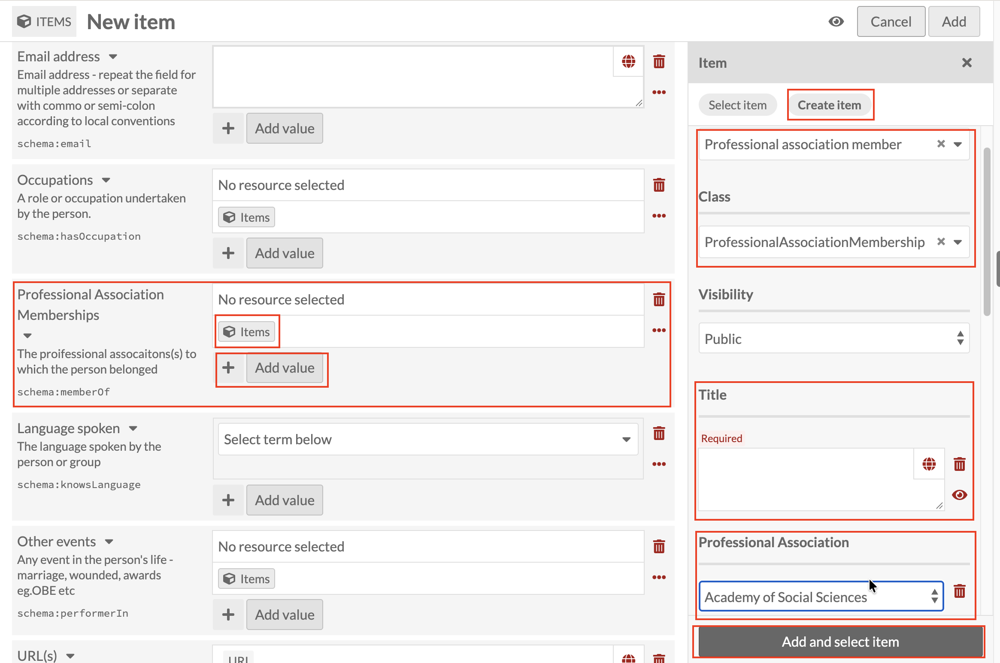

# Professional Association Memberships: linking a Professional association member record

*Part of [Adding Person Records](05-adding-person-records.md). Read
that page first for how a new record and the Person template work in
general.*

**Professional Association Memberships** uses the **Professional
association member** resource template (Class fills in as
`ProfessionalAssociationMembership`). Click the Items icon under
**Professional Association Memberships**, then **Create item**, and
set **Resource template** to **Professional association member**.

Like [Occupations](adding-person-records-occupations.md), this is a
field where a person can easily have more than one entry: memberships
in several different associations, for instance. Once you've added
the first record, use the **+** button next to **Add value** to add
another.

Title is required, and follows the same
**[Family name], [Initials] : [what the record is about]** pattern
introduced under
[Early education](adding-person-records-early-education.md), for
example `Smith, J.H. : Academy of Social Sciences`.

Below Title, **Professional Association** is a dropdown rather than
free text: select the association from the existing list rather than
typing it in, the same kind of controlled vocabulary field covered
under [Occupations](adding-person-records-occupations.md).

Once Title and Professional Association are done, click **Add and
select item** as before.
