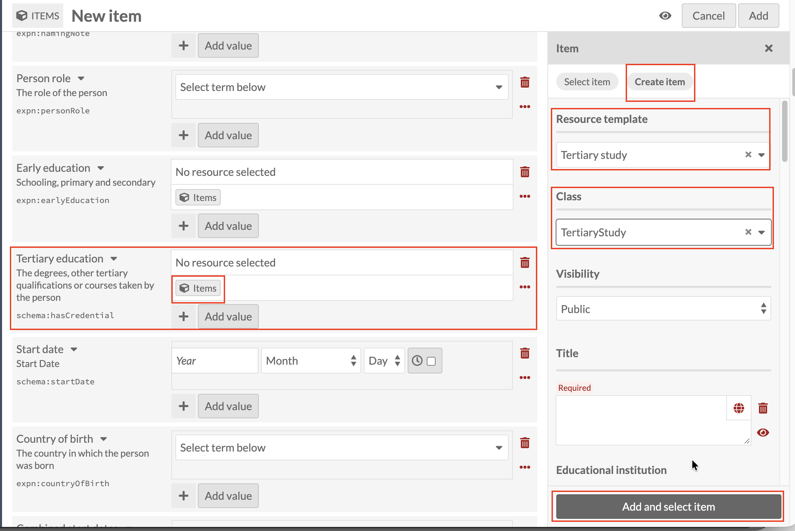
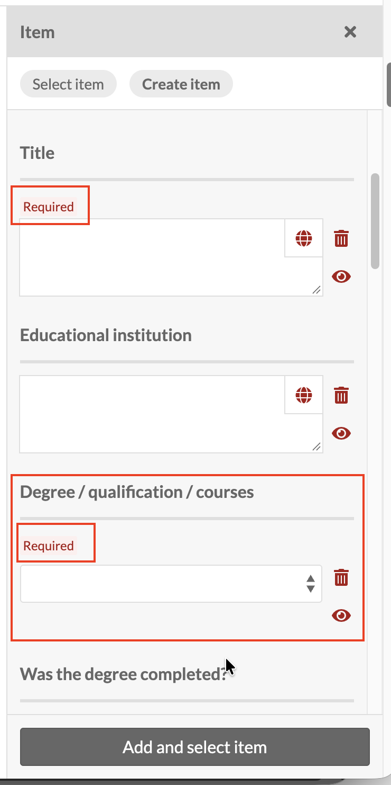

# Tertiary education: linking a Tertiary study record

*Part of [Adding Person Records](05-adding-person-records.md). Read
that page first for how a new record and the Person template work in
general.*

**Tertiary education** works the same way as
[Early education](adding-person-records-early-education.md), with one
difference worth pausing on: this sub-template has **two** required
fields, not one.

Click the Items icon under **Tertiary education**, then **Create item**,
and set **Resource template** to **Tertiary study** (Class fills in to
match, as before).

Here, both **Title** and **Degree / qualification / courses** carry the
red asterisk. Omeka won't let you add this record until both are filled
in. Title follows the exact same rule as every other linked sub-record:
use the **[Family name], [Initials] : [what the record is about]**
pattern introduced under
[Early education](adding-person-records-early-education.md), for example
`Smith, J.H. : Bachelor of Arts, University of Melbourne`. Educational
institution and "Was the degree completed?" are both optional, and can
be left blank.

As before, once Title and Degree / qualification / courses are filled
in, click **Add and select item** to create the record and link it into
the Tertiary education field on the Person you're building.
